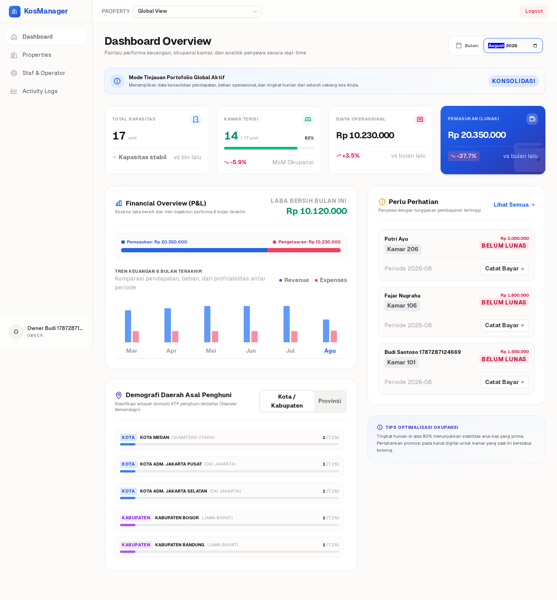
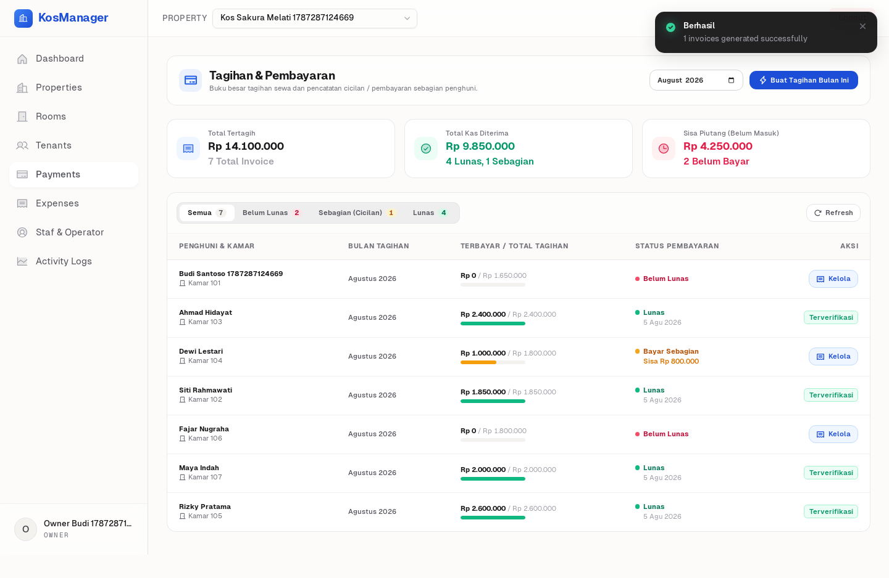
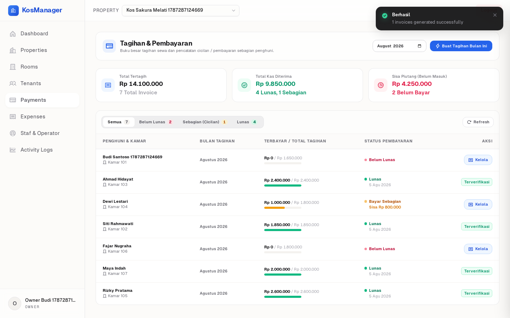
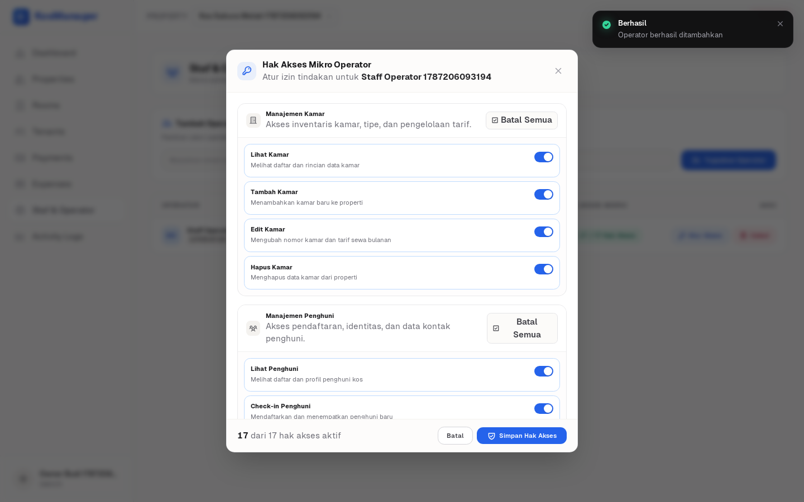
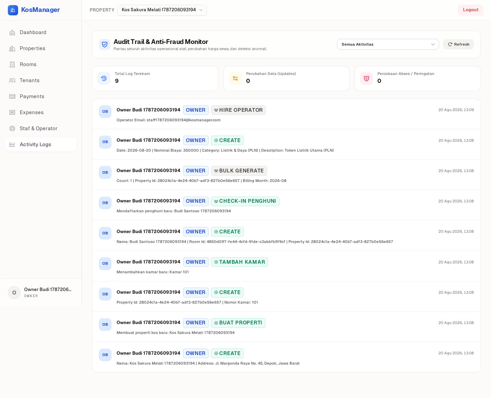
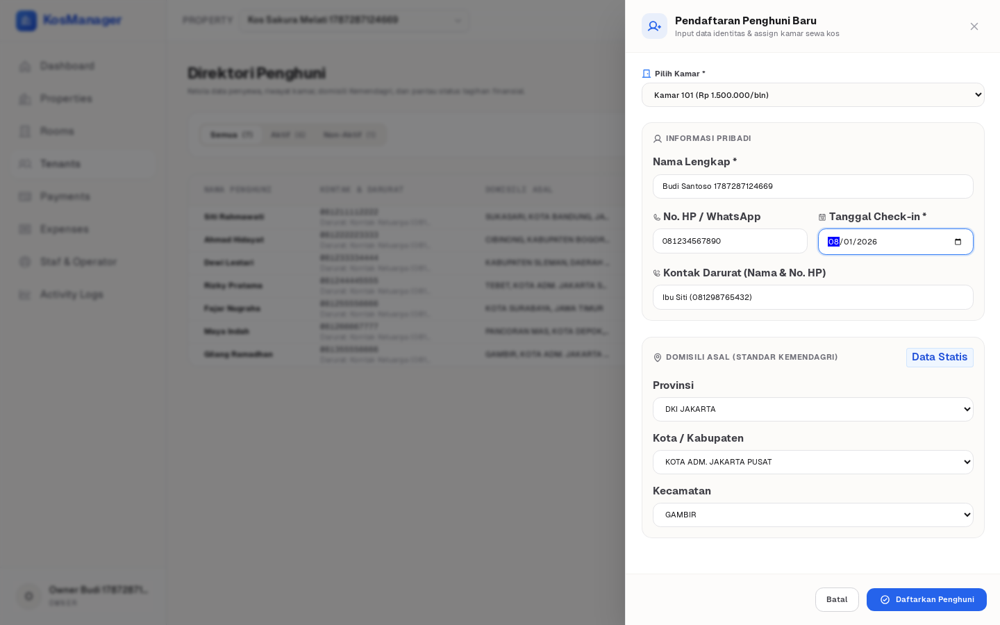
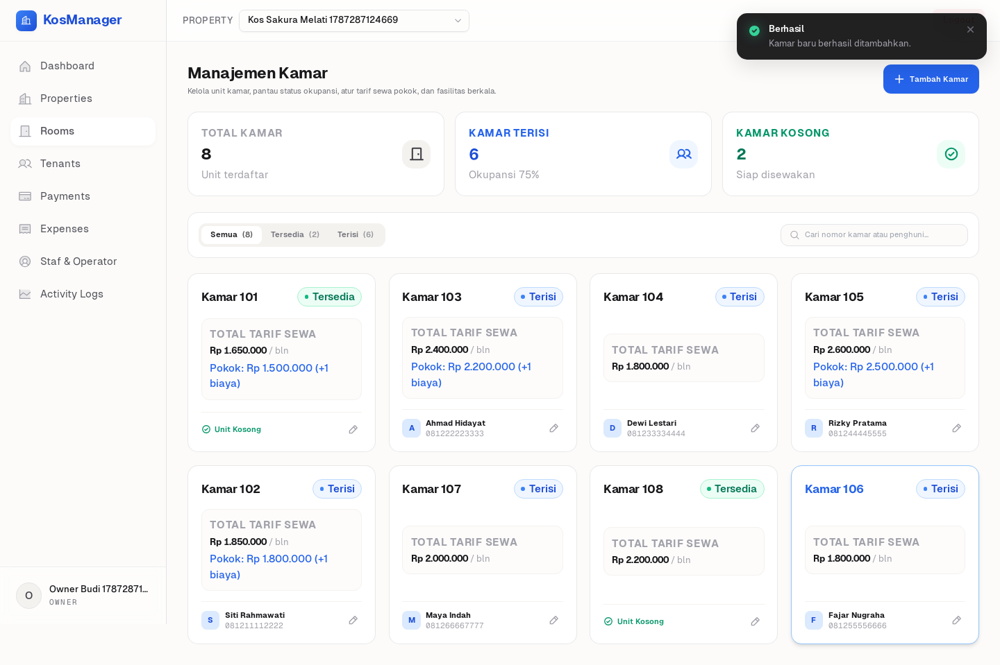
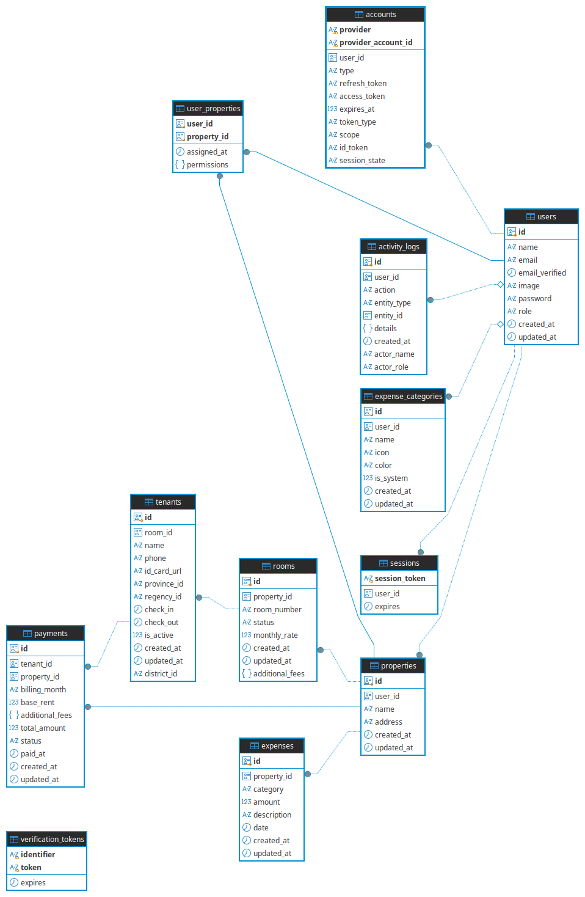

# KosManager 🏢
**Enterprise-Grade Property Management SaaS**




KosManager is a mature, production-ready SaaS application designed to streamline and automate property (kos/boarding house) management.

---

## 1. The "Why" (Business Value)
Managing multiple properties manually often leads to operational bottlenecks, financial discrepancies, and a lack of accountability. KosManager solves these systemic issues by providing:

- **Revenue Leakage Prevention:** Automated ledger and rollover arrears ensure every cent of base rent and additional fees (e.g., laundry, WiFi) is tracked and billed accurately.
- **Strict Accountability:** Fraud and unauthorized data mutations are mitigated through an immutable Audit Trail that logs exactly *who* did *what* and *when*.
- **Operational Scalability:** Superadmins can safely delegate tasks to Operators across multiple properties using a highly granular Role-Based Access Control (RBAC) matrix without compromising security.
- **Standardized Data:** Tenant demographics strictly adhere to external Kemendagri (Ministry of Home Affairs) standards, eliminating messy data entry and enabling accurate geographical analytics.

---

## 2. The "What" (Feature Surface)
Our core modules are designed to provide a secure and intuitive experience for property owners, operators, and super-administrators.

### Financial Ledger & Rollover Arrears
Automated monthly invoice generation capturing base rent and recurring additional fees. The system accurately rolls over unpaid arrears to subsequent billing cycles to ensure seamless financial tracking.



### Granular Micro-Permissions / RBAC
Advanced access control matrix separating the responsibilities of Superadmins, Owners, and Operators down to specific entity actions.


### Anti-Fraud Audit Trail
A rigorous activity logging system that tracks who did what and when, ensuring transparency and accountability for all data mutations and authentication events.


### Tenant Directory & Kemendagri API
Seamless tenant onboarding process featuring cascading dropdowns powered by accurate, standardized demographic data (Provinsi, Kota/Kabupaten, Kecamatan) based on Kemendagri standards.


### Responsive Card Grids
Dynamic, responsive views for managing properties and room inventory, displaying crucial metrics such as total vs occupied rooms and monthly rates.


---

## 3. The "How" (Engineering & Integration)

### Tech Stack & Architecture
KosManager is built with a highly modern, type-safe stack:
- **Framework:** Nuxt 4 & Vue 3 (Composition API)
- **Database & ORM:** PostgreSQL + Drizzle ORM (with `drizzle-zod` for automatic schema validation)
- **Styling:** Tailwind CSS integrated with Geist typography (Geist Sans & Geist Mono)
- **Validation:** Zod (for end-to-end type-safe APIs)
- **Authentication:** NextAuth.js via `@sidebase/nuxt-auth` (Bcrypt hashing, secure sessions)

### Database Schema & Entity Relationship Diagram (ERD)

KosManager is powered by PostgreSQL and Drizzle ORM, enforcing strict relational integrity, foreign key cascading, and domain indexing across 13 core tables grouped into 6 architectural domains.



#### 1. Identity & Access Management Domain
- **`users`**: Central account identity store containing credentials (`password` hashed with Bcrypt), user profile (`name`, `email`, `image`), and global system role (`superadmin`, `owner`, `operator`, `pending`).
- **`accounts`**: OAuth provider links (e.g., Google OAuth SSO) conforming to the Auth.js / NextAuth specification (`provider`, `provider_account_id`, `access_token`, `refresh_token`, etc.).
- **`sessions`**: Server-side user sessions managing active session tokens (`session_token`, `user_id`, `expires`).
- **`verification_tokens`**: Ephemeral tokens used for magic links, password resets, and email verification flows.

#### 2. Property & Room Inventory Domain
- **`properties`**: Physical boarding house (kos) locations owned by a user (`id`, `user_id`, `name`, `address`).
- **`rooms`**: Individual rentable room inventory units belonging to a specific property (`property_id`, `room_number`, `status: available | occupied`, `monthly_rate`). Supports dynamic `additional_fees` (`JSONB` array of line items such as `[{ "name": "AC", "amount": 150000 }]`).
- **`user_properties`**: Junction table establishing granular Role-Based Access Control (RBAC). Maps operators to assigned properties along with an explicit `permissions` array (`JSONB`) controlling micro-actions across rooms, tenants, payments, expenses, and reports.

#### 3. Tenant & Geographic Demographics Domain
- **`tenants`**: Active and historical resident records linked to assigned rooms (`room_id`, `name`, `phone`, `emergency_contact`, `id_card_url`, `check_in`, `check_out`, `is_active`).
- **Official Kemendagri Standardization**: Stores static external administrative IDs (`province_id`, `regency_id`, `district_id`) referencing the official Indonesian Ministry of Home Affairs data. This enables zero-overhead aggregation and accurate distinction between `KOTA` (City) and `KABUPATEN` (Regency) demographics on the dashboard without database bloat.

#### 4. Invoicing, Billing & Cash Ledger Domain
- **`payments`**: Recurring monthly billing invoices per tenant and property (`tenant_id`, `property_id`, `billing_month: YYYY-MM`, `base_rent`, `additional_fees`, `total_amount`, `amount_paid`, `status: paid | partial | unpaid`, `paid_at`). Supports automated delinquency tracking and rollover arrears.
- **`payment_transactions`**: Double-entry cash flow ledger recording individual payment installments and full settlements (`payment_id`, `amount`, `payment_date`, `recorded_by`, `notes`). Provides an immutable audit trail for split payments and partial receipts.

#### 5. Operational Expenses Domain
- **`expenses`**: Operational expenditures tracked per property (`property_id`, `category`, `amount`, `description`, `date`). Feeds directly into real-time Net Profit and 6-month P&L trajectory analytics.
- **`expense_categories`**: Dynamic taxonomy for expense classification supporting both built-in system defaults and user-defined custom categories with Phosphor icon names and Tailwind badge color tags (`name`, `icon`, `color`, `is_system`, `user_id`).

#### 6. Immutable Anti-Fraud Audit Trail Domain
- **`activity_logs`**: Immutable event stream recording all administrative mutations across the SaaS platform (`user_id`, `action: CREATE | UPDATE | DELETE | LOGIN`, `entity_type`, `entity_id`, `actor_name`, `actor_role`, `details: JSONB`). Captures before-and-after change diffs and actor context for forensic auditing.

### API Integration Reference
KosManager features a fully documented RESTful API layer protected by route-level role guards and correlation IDs (`reqId`). 
For client applications, third-party integrations, or mobile apps looking to interface with our core engine, please refer to the comprehensive API documentation:

👉 **[View the API Reference Manual](docs/API_REFERENCE.md)**

### CI/CD Pipeline
Every Pull Request and push to `main` goes through a rigorous GitHub Actions workflow (`.github/workflows/ci.yml`) to ensure production stability:
1. **Infrastructure Prep:** Spins up a PostgreSQL service container and Node.js 24.
2. **Strict Typechecking:** Executes `npx vue-tsc --noEmit` to catch type errors.
3. **Backend Testing:** Runs comprehensive API and Unit tests via `Vitest`.
4. **Build Verification:** Executes `npm run build` to ensure the Nuxt bundle compiles flawlessly.
5. **Database Migrations:** Applies `drizzle-kit migrate` against a clean test database.
6. **E2E Visual Tests:** Installs Playwright Chromium and executes full user journeys.

---

## Environment Variables
Create a `.env` file in the root directory based on `.env.example`.

| Variable | Description |
| :--- | :--- |
| `AUTH_ORIGIN` | The main URL of the application (e.g., `http://localhost:3000`). |
| `AUTH_SECRET` | A random 32+ character secret for encrypting secure sessions. |
| `GOOGLE_CLIENT_ID` | Your Google OAuth Client ID for SSO. |
| `GOOGLE_CLIENT_SECRET` | Your Google OAuth Client Secret for SSO. |
| `DB_USER` / `DB_PASSWORD` / `DB_NAME` | Database credentials used by the Docker PostgreSQL container. |
| `DOCKER_DB_CONTAINER` | The designated name for the Docker DB container (default: `kosmanager-db`). |
| `DATABASE_URL` | Application connection string (use `host.docker.internal` locally or `db:5432` in Docker). |
| `DATABASE_MIGRATE_URL` | Dedicated connection string for running Drizzle migrations from your local terminal. |

---

## Getting Started (Local & Docker)

KosManager is fully containerized for a frictionless developer experience. 

1. **Clone the repository**
   ```bash
   git clone https://github.com/akhmadtaufik/kos-manager.git
   cd kos-manager
   ```

2. **Start the environment with Docker Compose**
   ```bash
   docker compose up -d --build
   ```
   *This single command builds the application, spins up the PostgreSQL container (`kosmanager-db`), executes Drizzle migrations, and starts the Nuxt Nitro server.*

3. **Access the application**
   Navigate to [http://localhost:3000](http://localhost:3000) in your browser.

---

## Available Scripts

If you choose to run the project locally outside of Docker, these npm scripts (`package.json`) are available:

| Script | Command | Description |
| :--- | :--- | :--- |
| `dev` | `nuxt dev` | Starts the Nuxt development server with HMR. |
| `build` | `nuxt build` | Compiles the Nuxt application for production environments. |
| `preview` | `nuxt preview` | Locally previews the production build output. |
| `generate` | `nuxt generate` | Pre-renders the application (for static deployments). |
| `db:generate` | `npx drizzle-kit generate` | Generates SQL migration files based on schema changes. |
| `db:migrate` | `npx drizzle-kit migrate` | Applies pending migrations directly to the database. |
| `db:push` | `npx drizzle-kit push` | Pushes schema changes forcefully without migrations (for rapid prototyping). |
| `db:studio` | `npx drizzle-kit studio` | Launches the Drizzle Studio UI to visually browse your database. |
| `test` | `vitest` | Runs the Vitest test suite for API routes and unit testing. |
| `test:e2e` | `playwright test` | Executes Playwright end-to-end tests for UI and user flows. |

---

## Testing Strategy
We maintain a strict **100% passing test rate** driven by mathematically rigorous test cases.
- **API Tests (Vitest):** Found in `tests/api/`, these scripts comprehensively cover CRUD operations, edge cases, financial calculations, and Zod validations against our backend routes.
- **E2E Visual Tests (Playwright):** Found in `tests/e2e/`, testing full user journeys (Owner Registration $\rightarrow$ Tenant Check-in $\rightarrow$ Invoice Generation) and generating visual documentation assets.

---

## Project Structure
KosManager enforces a strict Separation of Concerns (SoC) between the Vue frontend (`app/`) and the Nitro backend (`server/`).

```text
kosmanager/
├── app/                      # Vue 3 Frontend (Client-side & SSR)
│   ├── components/           # Reusable UI components and slide-overs
│   ├── composables/          # Vue Composition API hooks (state management)
│   ├── layouts/              # Global page wrappers (e.g., dashboard sidebar)
│   ├── middleware/           # Client-side route guards (Vue Router)
│   └── pages/                # File-based routing (Nuxt Pages)
├── server/                   # Nitro Backend API & Database
│   ├── api/                  # RESTful API Endpoints (e.g., auth, properties, reports)
│   ├── db/                   # Drizzle ORM schemas, relations, and migrations
│   ├── middleware/           # Server-side middleware (Auth, RBAC, Audit Guards)
│   ├── plugins/              # Nitro plugins (Error handlers, OpenAPI generator)
│   ├── services/             # Core business logic layer (Separation of Concerns)
│   └── utils/                # Shared utilities (Zod validations, hashing, loggers)
├── shared/                   # Shared TypeScript interfaces across front/back ends
├── tests/                    # Comprehensive Test Suites
│   ├── api/                  # Vitest Backend Integration Tests
│   └── e2e/                  # Playwright Full User Journey Visual Tests
├── docs/                     # Documentation 
│   ├── screenshots/          # High-res UI assets
│   └── API_REFERENCE.md      # Detailed OpenAPI/REST endpoints manual
├── docker-compose.yml        # Multi-container orchestration (PostgreSQL + Node)
├── package.json              # Dependencies and run scripts
└── nuxt.config.ts            # Core framework configuration
```
